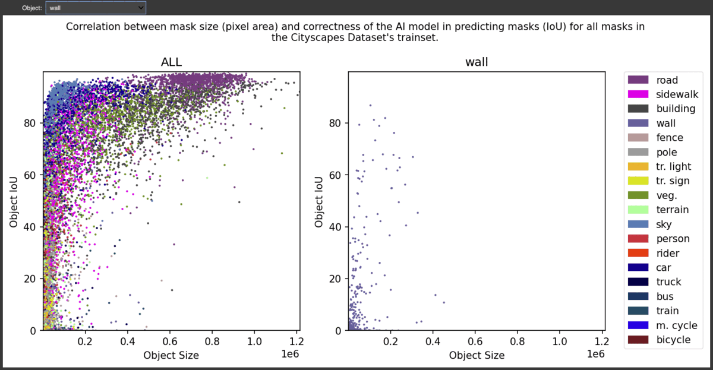

<!-- # Requirements
```
conda create -n vis python=3.7
conda activate vis
pip install notebook
# MPS acceleration is available on MacOS 12.3+
conda install pytorch::pytorch torchvision torchaudio -c pytorch
conda install matplotlib
pip install einops
conda install -c anaconda pandas
conda install -c conda-forge ipywidgets

jupyter nbextension enable --py --sys-prefix widgetsnbextension
jupyter nbextension enable --py widgetsnbextension
pip install --upgrade jupyter_client

conda install -c conda-forge notebook
conda install -c conda-forge nb_conda_kernels

conda install -c anaconda jupyter
```

```
conda create -n vis python=3.7
conda activate vis
conda install pip
pip install jupyterlab
pip install ipywidgets
conda install pytorch::pytorch torchvision torchaudio -c pytorch
pip install chardet 
conda install matplotlib
pip install einops
conda install -c anaconda pandas
pip install ipympl

``` -->

# SeeBel: <ins>See</ins>ing is <ins>Bel</ins>ieving


## 👨🏻‍💻 Domain
- [x] Computer Vision
- [x] Machine Learning
- [x] Semantic Segmentation 

## 💪 Use Case
- [ ] TODO 

## 🚀 Quick Tour
### Vis 1

### Vis 2
https://user-images.githubusercontent.com/13894030/237001350-b1e8baa2-cb82-4764-873e-035e3488d3d6.mp4


- [ ] Vis 3

## ✅ Prerequisites

Before you begin, ensure you have met the following requirements:
* You have latest `conda` installed
* You have a `<Linux/Mac>` machine.

## ⚡️ Installing SeeBel

To install SeeBel, follow these steps:

### macOS:
```
conda create -n seebel python=3.7
conda activate seebel
conda install pip
pip install jupyterlab
pip install ipywidgets
conda install pytorch::pytorch torchvision torchaudio -c pytorch
pip install chardet 
conda install matplotlib
pip install einops
conda install -c anaconda pandas
pip install ipympl
```

### Linux:
```
conda create -n seebel python=3.7
conda activate seebel
conda install pip
pip install jupyterlab
pip install ipywidgets
conda install pytorch torchvision torchaudio cpuonly -c pytorch
pip install chardet 
conda install matplotlib
pip install einops
conda install -c anaconda pandas
pip install ipympl
```
## 🕹️ Using SeeBel

To use SeeBel, follow these steps:

```
cd codes/final
jupyter-lab
```
From the jupyter-lab environment, run individual visualizations in the `final` folder.

## 🤗 Contributing to SeeBel
To contribute to SeeBel, follow these steps:

1. Fork this repository.
2. Create a branch: `git checkout -b <branch_name>`.
3. Make your changes and commit them: `git commit -m '<commit_message>'`
4. Push to the original branch: `git push origin <project_name>/<location>`
5. Create the pull request.

Alternatively see the GitHub documentation on [creating a pull request](https://help.github.com/en/github/collaborating-with-issues-and-pull-requests/creating-a-pull-request).

## 🙏 Contributors

Thanks to the following people who have contributed to this project:

* [@sourajitcs](https://github.com/sourajitcs)

## ✉️ Contact

If you want to contact me you can reach me at [@Shubhashis Roy Dipta](mailto:sroydip1@umbc.edu) or my teammate at [@Sourajit Saha](mailto:sroydip1@umbc.edu)


## 🪪 License

This project uses the following license: [MIT License](./LICENSE).
